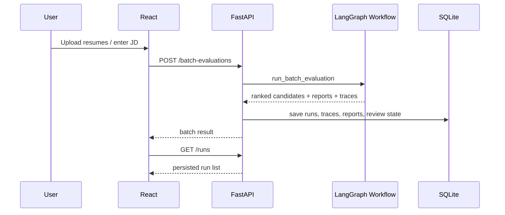
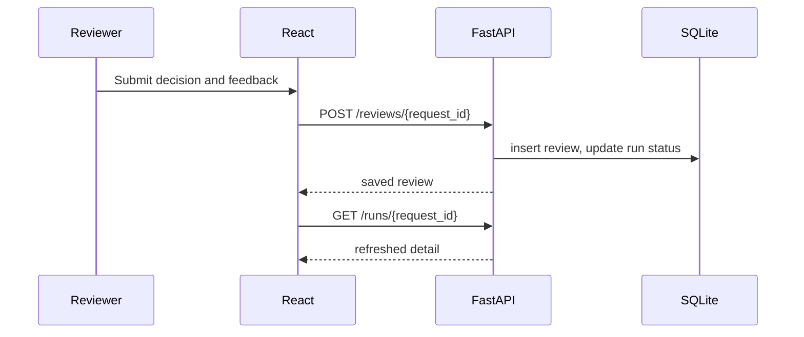

## Overview

The React control cabin is the operator interface for Agentic HR. It should feel like a serious recruiting operations cockpit, not a marketing site and not a beginner demo. The Apple reference is used for restraint: quiet surfaces, one action blue, clean typography, minimal chrome, and precise spacing. The domain adaptation is density: HR users need ranking tables, evidence snippets, trace timelines, report previews, email delivery, review queues, and API state in one working surface.

The React frontend talks only to FastAPI. It never imports Python workflow code, never reads local files directly, and never writes SQLite directly. This gives the project a clear front-end/back-end split that is easy to explain in interviews:

```text
React Control Cabin -> FastAPI Service -> LangGraph Workflow -> SQLite Persistence
```

## Product Goals

- Make the project look and operate like a landing-oriented internal tool.
- Make the Harness idea visible: every run has trace, replay metadata, extraction quality, report quality, and review state.
- Make the AI safety boundary visible: model predicts manual-review risk, not hiring decisions.
- Make debugging possible from the UI: show parsing mode, LLM status, risk features, evidence, trace events, and error reasons.
- Keep report email delivery available through FastAPI so the control cabin covers the full HR review workflow.

## Frontend Architecture

### Stack

Recommended stack:

- React + TypeScript + Vite
- React Router for page routing
- TanStack Query for API state and cache invalidation
- Plain CSS modules or scoped CSS files for a small project footprint
- lucide-react for icons
- Vitest + React Testing Library for frontend tests

Vite is preferred over Next.js because this is an internal control dashboard, not an SEO or SSR product. It keeps the build simple, fast, and easy to integrate with FastAPI static serving later.

### Directory Layout

```text
frontend/
  package.json
  vite.config.ts
  index.html
  src/
    main.tsx
    App.tsx
    api/client.ts
    api/types.ts
    components/
      AppShell.tsx
      Button.tsx
      StatusChip.tsx
      MetricTile.tsx
      DataTable.tsx
      EvidenceList.tsx
      TraceTimeline.tsx
      ReportPreview.tsx
    pages/
      DashboardPage.tsx
      BatchEvaluationPage.tsx
      RunDetailPage.tsx
      ReviewQueuePage.tsx
      SettingsPage.tsx
    styles/
      tokens.css
      app.css
```

### Page Model

1. **Dashboard**
   - Shows recent runs, batch counts, pending human reviews, average parse quality, and model usage.
   - Primary action: start a new batch evaluation.

2. **Batch Evaluation**
   - Upload resumes or paste structured resume text for demo mode.
   - Configure JD, risk model path, LLM extraction toggle, report enhancement toggle.
   - Submit to `POST /batch-evaluations`.
   - After completion, show ranked candidates and batch report.

3. **Run Detail**
   - Shows one workflow run by `request_id`.
   - Sections: candidate summary, JD summary, match breakdown, risk features, evidence snippets, trace timeline, report preview.

4. **Review Queue**
   - Lists candidates requiring human review.
   - Shows reasons: OCR needed, low parse quality, missing evidence, high manual-review risk, workflow errors.
   - Allows approve/reject/revise/need_more_info feedback.

5. **Settings**
   - API base URL.
   - Default risk model path.
   - LLM toggle defaults.
   - Read-only backend health.

## UI Principles

### Operational Density

This is not a landing page. Avoid oversized hero sections, decorative cards, and marketing copy. The first viewport should show useful work: run status, review queue, recent evaluations, and primary actions.

### Evidence First

Every score should have a nearby explanation:

- Match score links to matched skills and evidence strength.
- Risk score links to model features and review reasons.
- LLM extraction status links to provider message and fallback state.
- Parse quality links to parser, OCR need, and quality flags.

### Calm Apple-Inspired Surface

Use the Apple design tokens as restraint, not as low-density product marketing:

- One accent blue for actions.
- White/parchment surfaces.
- 8px panel radius, not large rounded decorative cards.
- No gradients, no ornamental shadows.
- Tables and panels use hairline borders.
- Typography stays compact and legible.

## FastAPI Boundary

React should call these backend endpoints:

```text
GET  /health
POST /evaluations
POST /batch-evaluations
GET  /runs
GET  /runs/{request_id}
GET  /reviews
POST /reviews/{request_id}
GET  /reports/{request_id}
GET  /traces/{request_id}
```

Existing endpoints already cover health, evaluations, batch evaluations, and runs. The next backend step is to add review/report/trace endpoints backed by normalized SQLite tables.

## SQLite Architecture

The current SQLite store saves complete payload and trace in `workflow_runs`. The production-oriented next step is to normalize while keeping the full payload for replay:

```text
runs
  request_id primary key
  batch_id nullable
  current_step
  match_score
  risk_score
  human_review_status
  created_at
  updated_at

candidates
  request_id foreign key
  name
  education
  years_experience
  candidate_track
  expected_salary
  profile_json

jobs
  request_id foreign key
  title
  required_years
  recruitment_track
  required_skills_json
  profile_json

traces
  id primary key
  request_id foreign key
  node
  timestamp
  output_summary
  extra_json

reviews
  id primary key
  request_id foreign key
  decision
  feedback
  reviewer
  created_at

reports
  request_id primary key
  markdown
  quality_json
  created_at

artifacts
  id primary key
  request_id foreign key
  artifact_type
  path
  metadata_json
```

This supports both UI queries and replay/debug workflows. `payload_json` can remain in `runs` as an escape hatch, but UI should prefer normalized tables for list/detail screens.

## Data Flow

### Batch Evaluation



### Human Review



## Component Details

### AppShell

Two bars:

- `top-bar`: dark, 44px high, contains product name and health indicator.
- `sub-nav`: frosted parchment, 56px high, contains page tabs and primary action.

Main workspace is constrained to 1440px with 24px padding.

### CandidateRankingTable

Columns:

- Rank
- Candidate
- Track
- Match
- Risk
- Evidence confidence
- Parser / parse quality
- LLM status
- Review reason
- Action

Rows should be stable height. Long reasons truncate with tooltip or expandable detail.

### RunDetailPanel

Tabs:

- Overview
- Evidence
- Risk Features
- Trace
- Report

No nested cards. Use panels and bordered rows.

### ReviewQueue

Focuses on action. Each row shows the reason, the minimum required context, and a compact review form. Decisions use segmented controls:

- Approve
- Reject
- Revise
- Need more info

### TraceTimeline

Shows node, timestamp, summary, and extra metadata. Failed nodes and fallback paths are visually marked with warning/danger chips.

## Error Handling

Frontend states:

- API unavailable: show health warning in top bar and disable run buttons.
- Evaluation running: show progress region and prevent duplicate submit.
- Backend validation error: show field-level messages if possible.
- Workflow error: keep result visible, mark run as needing review, show trace.
- Empty states: useful action, not explanatory marketing copy.

Backend states:

- All workflow errors should be returned as structured JSON and persisted.
- Review updates must be idempotent per request id.
- SQLite initialization must be automatic at app startup.

## Final Frontend Strategy

1. React + TypeScript + Vite is the only control cabin UI.
2. FastAPI is the only workflow, persistence, upload, review, report, and email boundary.
3. SQLite stores normalized run, trace, report, review, batch, and email-delivery records while preserving full JSON payloads.
4. README and project plan document React/FastAPI as the canonical local demo path.
5. Any future production UI work should extend React instead of adding a second UI runtime.

## Testing Strategy

### Frontend

- Unit test API client request/response handling.
- Component test table rendering, status chips, review form submission.
- Smoke test routing with mocked API.

### Backend

- FastAPI tests for new review/report/trace endpoints.
- SQLite tests for normalized table writes and reads.
- Regression tests to ensure old workflow runner still passes.

### End-to-End

- Start FastAPI and Vite locally.
- Run one demo batch.
- Verify ranked list, run detail, evidence, trace, report, review update.
- Capture screenshots for README/demo.

## Do's and Don'ts

### Do

- Use React as the UI and FastAPI as the only workflow boundary.
- Keep report preview, review submission, and email delivery in the same operator flow.
- Make evidence and trace visible beside scores.
- Use one blue accent for actions.
- Use compact, stable tables and panels.
- Preserve `.env`, uploaded resumes, SQLite DB, and generated reports outside git.

### Don't

- Don't let React import Python modules or read SQLite directly.
- Don't build a marketing landing page as the first screen.
- Don't hide model limitations; the risk model predicts manual-review need only.
- Don't use decorative gradients, oversized cards, or one-note purple/blue dashboards.
- Don't add a second control-cabin runtime unless there is a clear production requirement.

## Known Gaps

- API is synchronous; large batch runs may need background jobs later.
- Authentication and authorization are not in scope for this migration step.
- SQLite is suitable for local demo and small deployments; PostgreSQL should be the next step for multi-user production.
- The current React app is functional, but it can still be expanded with filtering, batch detail pages, and email delivery history.
