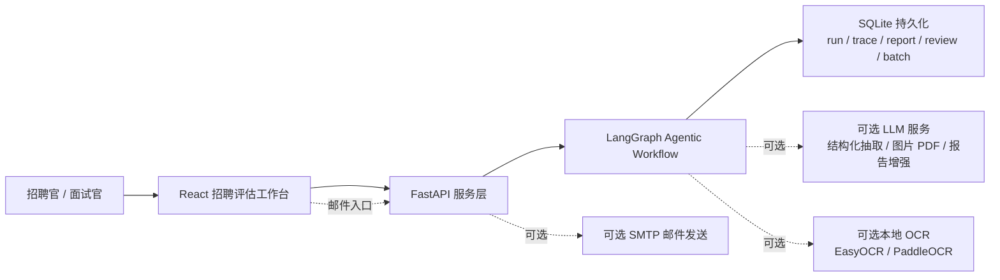
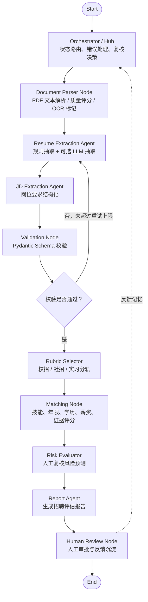
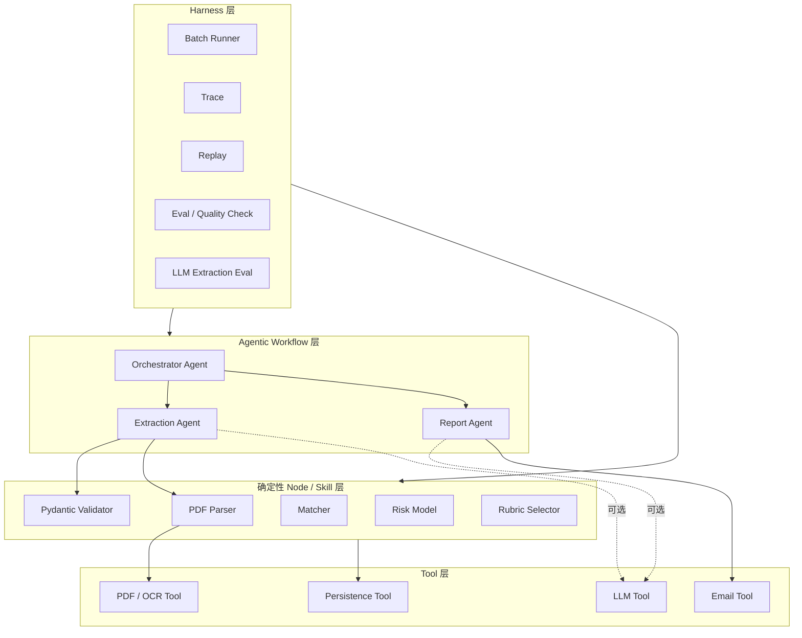
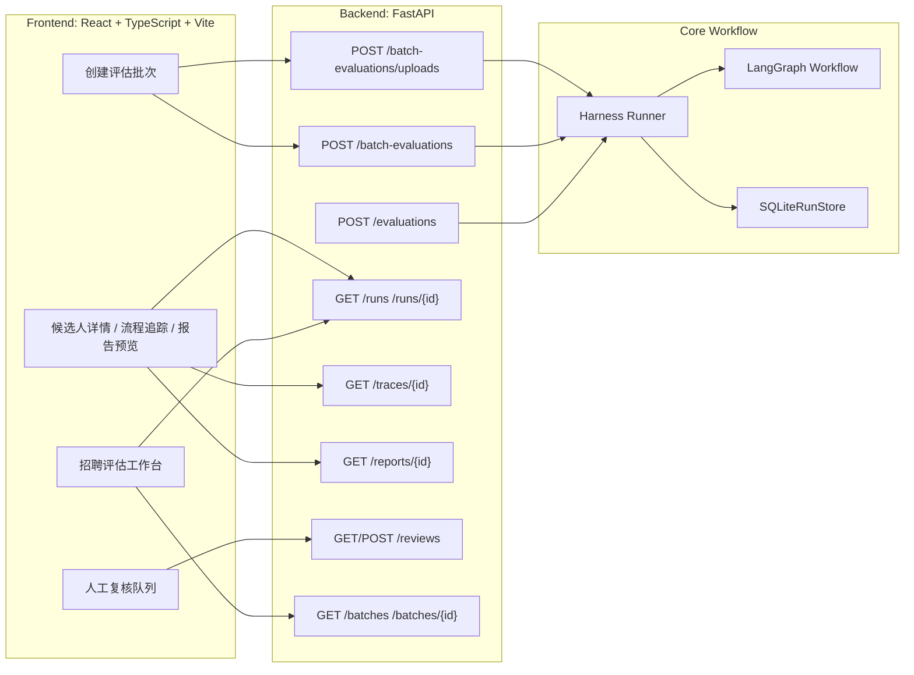
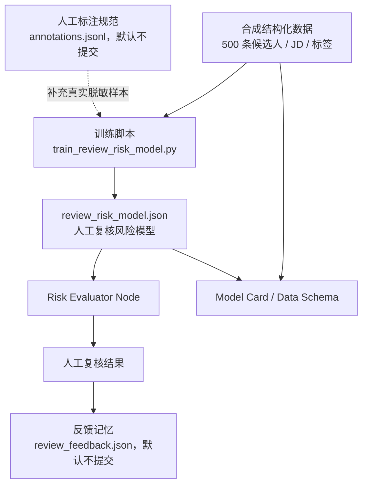
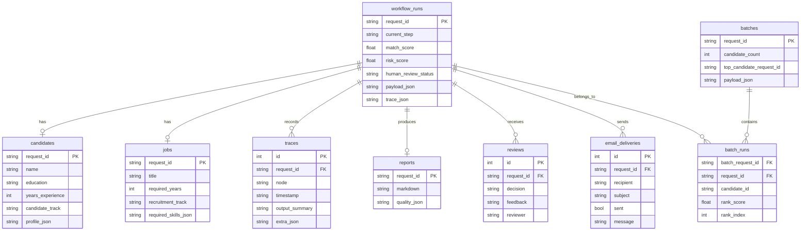
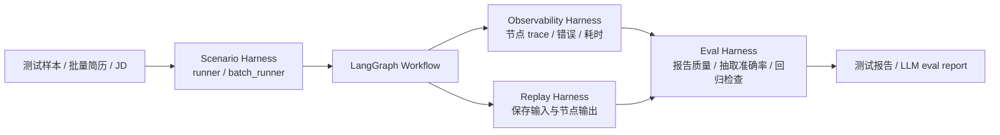
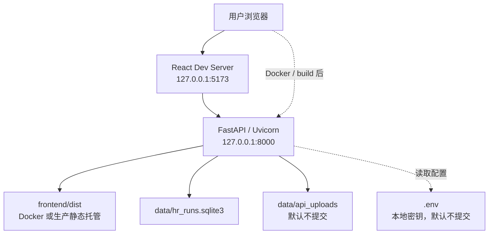
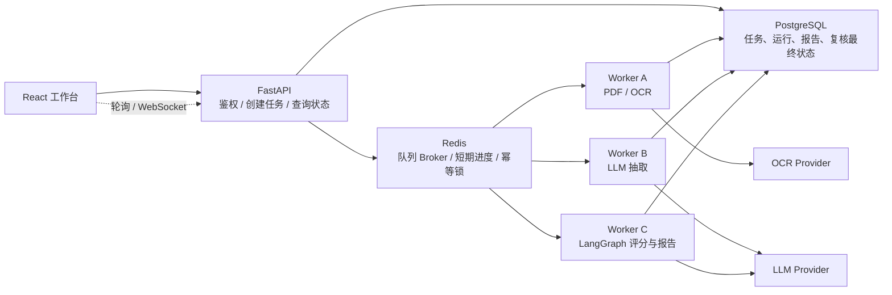
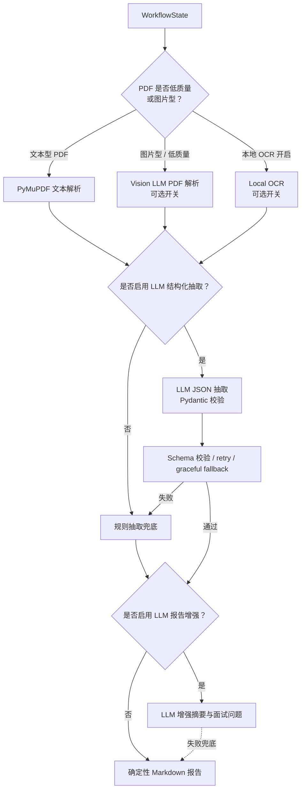

# Architecture Diagrams

这些图用于 README、答辩和面试讲解。图中分为两类：

- 已实现：当前仓库已经具备的能力。
- 生产化演进：面向真实部署的扩展设计，例如 Redis、异步队列、PostgreSQL 和鉴权。

## 1. 系统上下文

## 2. Hub-and-Spoke Agent 工作流

## 3. Agent、Node、Tool、Harness 边界

## 4. 前后端分层

## 5. 数据与 ML 闭环

## 6. SQLite 持久化表关系

## 7. Harness 运行、评估与回放

## 8. 当前本地部署架构

## 9. 生产化异步并发演进

当前版本为了演示稳定采用同步 API 调用。真实部署可演进为异步任务架构：

面试表述要点：

- 当前没有强行把 Redis 放进 MVP，因为本地演示同步流程更稳定。
- 架构已经通过 `request_id`、批次表、trace 表和 review 表做好并发隔离。
- 长耗时任务如 OCR、Vision LLM、批量评估适合迁移到 Redis Queue + Worker。
- Redis 用作 broker、短期进度缓存和幂等锁；PostgreSQL 保存最终业务状态。

## 10. LLM 与工具调用路径

