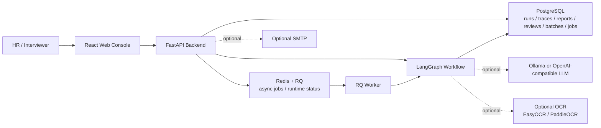
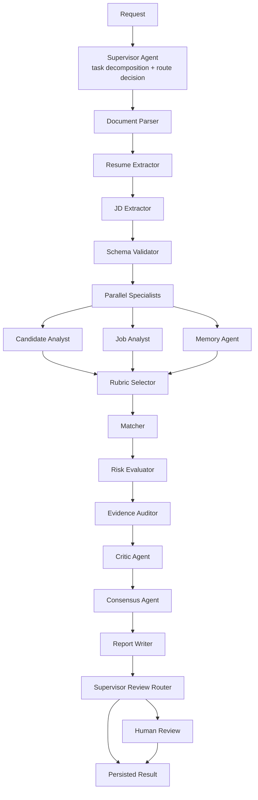
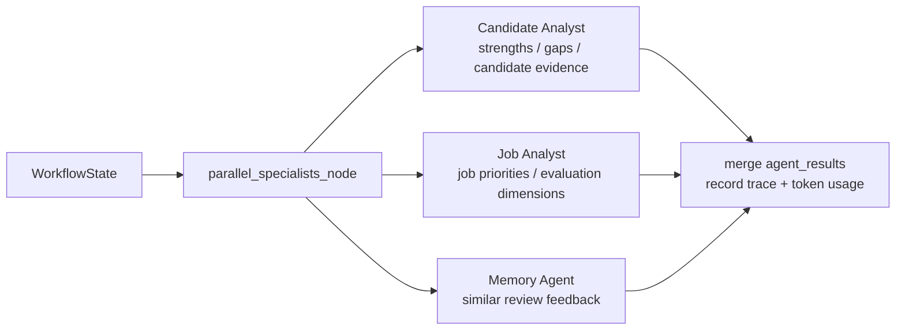
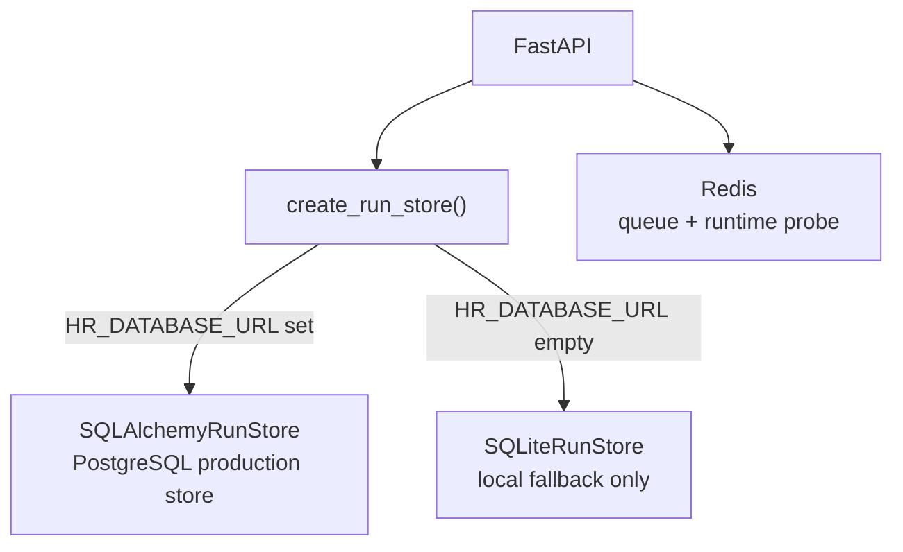
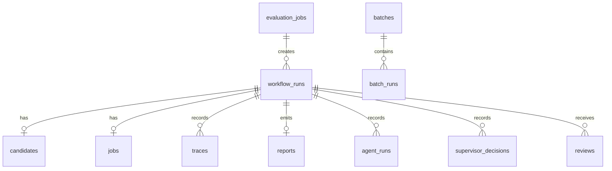
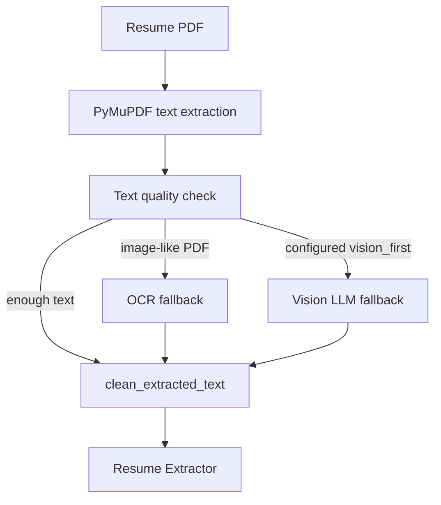
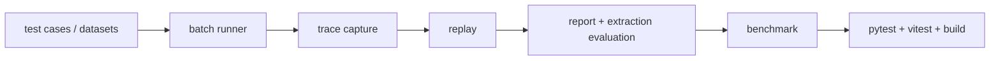
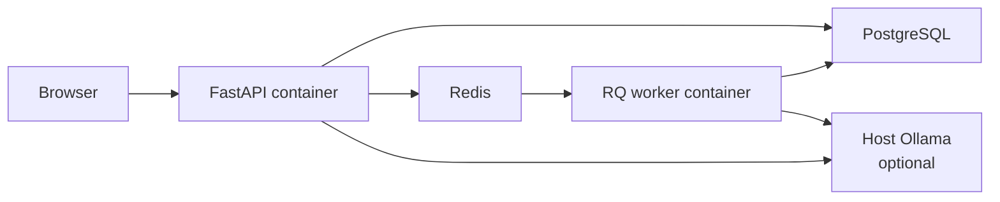

# Resume Pilot Architecture Diagrams

这些图用于 README、答辩和面试讲解。当前项目口径统一为：

- 后端服务：FastAPI。
- 工作流编排：Supervisor-centered LangGraph。
- 生产主库：PostgreSQL，通过 `SQLAlchemyRunStore` 接入。
- 异步任务与运行状态：Redis + RQ worker。
- 本地 fallback：未配置 `HR_DATABASE_URL` 时才使用 SQLite。

## 1. System Context

## 2. Supervisor-Centered Workflow

## 3. Parallel Specialist Fan-Out/Fan-In

## 4. Data And Runtime Store

## 5. Persistence Tables

PostgreSQL and SQLite share the same logical run-store responsibilities.

## 6. Document Parsing Strategy

## 7. Harness Verification Loop

## 8. Deployment Shape

