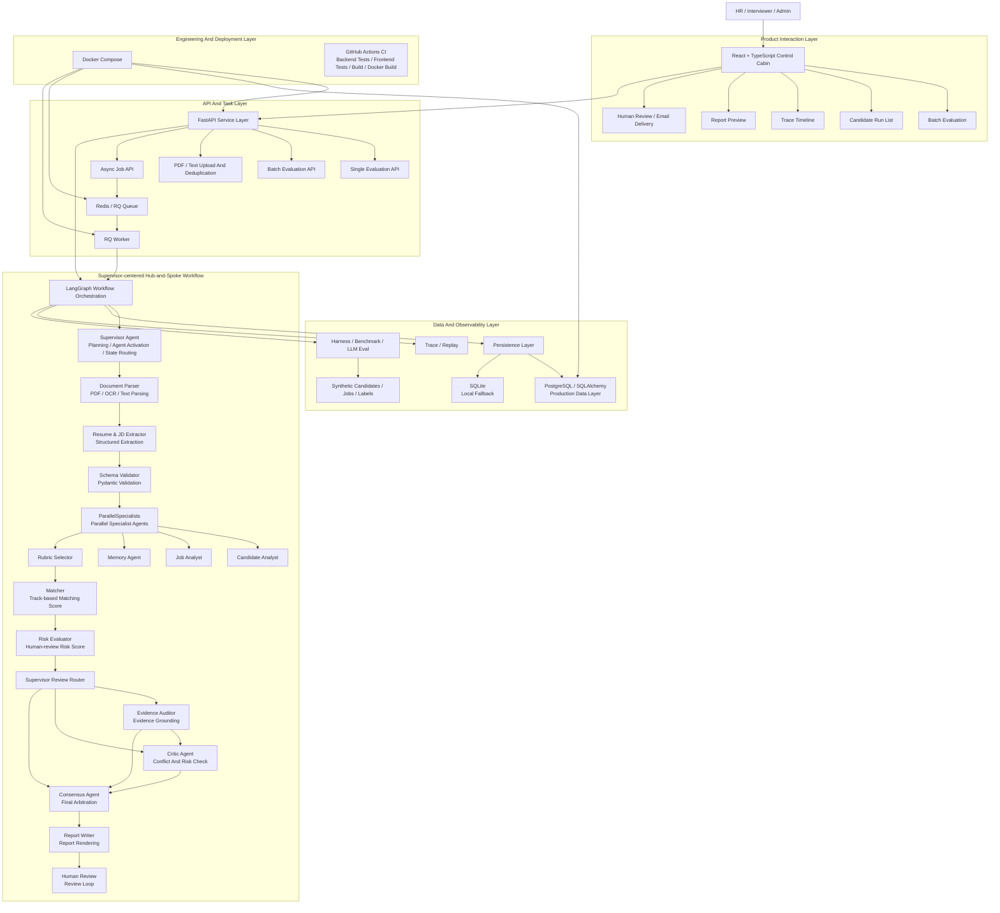
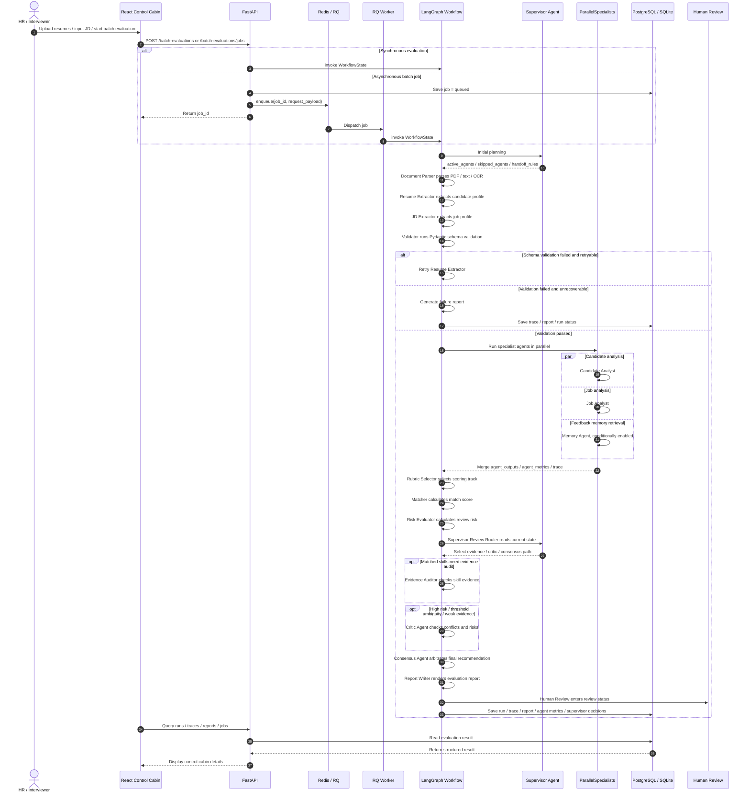

# Project Architecture And Runtime Flow

## Project Architecture

```mermaid
flowchart TB
    User["HR / Interviewer / Admin"] --> Frontend["React + TypeScript Control Cabin"]

    subgraph Product["Product Interaction Layer"]
        Frontend --> UI1["Batch Evaluation"]
        Frontend --> UI2["Candidate Run List"]
        Frontend --> UI3["Trace Timeline"]
        Frontend --> UI4["Report Preview"]
        Frontend --> UI5["Human Review / Email Delivery"]
    end

    Frontend --> API["FastAPI Service Layer"]

    subgraph APIService["API And Task Layer"]
        API --> EvalAPI["Single Evaluation API"]
        API --> BatchAPI["Batch Evaluation API"]
        API --> UploadAPI["PDF / Text Upload And Deduplication"]
        API --> JobAPI["Async Job API"]
        JobAPI --> Redis["Redis / RQ Queue"]
        Redis --> Worker["RQ Worker"]
    end

    API --> Workflow["LangGraph Workflow Orchestration"]
    Worker --> Workflow

    subgraph AgentWorkflow["Supervisor-centered Hub-and-Spoke Workflow"]
        Workflow --> Supervisor["Supervisor Agent\nPlanning / Agent Activation / State Routing"]
        Supervisor --> Parser["Document Parser\nPDF / OCR / Text Parsing"]
        Parser --> Extractor["Resume & JD Extractor\nStructured Extraction"]
        Extractor --> Validator["Schema Validator\nPydantic Validation"]

        Validator --> Parallel["ParallelSpecialists\nParallel Specialist Agents"]
        Parallel --> CA["Candidate Analyst"]
        Parallel --> JA["Job Analyst"]
        Parallel --> MA["Memory Agent"]

        Parallel --> Rubric["Rubric Selector"]
        Rubric --> Matcher["Matcher\nTrack-based Matching Score"]
        Matcher --> Risk["Risk Evaluator\nHuman-review Risk Score"]

        Risk --> ReviewRouter["Supervisor Review Router"]
        ReviewRouter --> EA["Evidence Auditor\nEvidence Grounding"]
        ReviewRouter --> Critic["Critic Agent\nConflict And Risk Check"]
        EA --> Critic
        EA --> Consensus["Consensus Agent\nFinal Arbitration"]
        Critic --> Consensus
        ReviewRouter --> Consensus

        Consensus --> Report["Report Writer\nReport Rendering"]
        Report --> Human["Human Review\nReview Loop"]
    end

    Workflow --> Store["Persistence Layer"]

    subgraph DataLayer["Data And Observability Layer"]
        Store --> PostgreSQL["PostgreSQL / SQLAlchemy\nProduction Data Layer"]
        Store --> SQLite["SQLite\nLocal Fallback"]
        Workflow --> Trace["Trace / Replay"]
        Workflow --> Harness["Harness / Benchmark / LLM Eval"]
        Harness --> Dataset["Synthetic Candidates / Jobs / Labels"]
    end

    subgraph Infra["Engineering And Deployment Layer"]
        Docker["Docker Compose"] --> API
        Docker --> PostgreSQL
        Docker --> Redis
        Docker --> Worker
        CI["GitHub Actions CI\nBackend Tests / Frontend Tests / Build / Docker Build"]
    end
```

## Runtime Execution Flow

```mermaid
sequenceDiagram
    autonumber
    actor HR as HR / Interviewer
    participant UI as React Control Cabin
    participant API as FastAPI
    participant Queue as Redis / RQ
    participant Worker as RQ Worker
    participant Graph as LangGraph Workflow
    participant Supervisor as Supervisor Agent
    participant Specialists as ParallelSpecialists
    participant Store as PostgreSQL / SQLite
    participant Review as Human Review

    HR->>UI: Upload resumes / input JD / start batch evaluation
    UI->>API: POST /batch-evaluations or /batch-evaluations/jobs

    alt Synchronous evaluation
        API->>Graph: invoke WorkflowState
    else Asynchronous batch job
        API->>Store: Save job = queued
        API->>Queue: enqueue(job_id, request_payload)
        API-->>UI: Return job_id
        Queue->>Worker: Dispatch job
        Worker->>Graph: invoke WorkflowState
    end

    Graph->>Supervisor: Initial planning
    Supervisor-->>Graph: active_agents / skipped_agents / handoff_rules

    Graph->>Graph: Document Parser parses PDF / text / OCR
    Graph->>Graph: Resume Extractor extracts candidate profile
    Graph->>Graph: JD Extractor extracts job profile
    Graph->>Graph: Validator runs Pydantic schema validation

    alt Schema validation failed and retryable
        Graph->>Graph: Retry Resume Extractor
    else Validation failed and unrecoverable
        Graph->>Graph: Generate failure report
        Graph->>Store: Save trace / report / run status
    else Validation passed
        Graph->>Specialists: Run specialist agents in parallel

        par Candidate analysis
            Specialists->>Specialists: Candidate Analyst
        and Job analysis
            Specialists->>Specialists: Job Analyst
        and Feedback memory retrieval
            Specialists->>Specialists: Memory Agent, conditionally enabled
        end

        Specialists-->>Graph: Merge agent_outputs / agent_metrics / trace

        Graph->>Graph: Rubric Selector selects scoring track
        Graph->>Graph: Matcher calculates match score
        Graph->>Graph: Risk Evaluator calculates review risk

        Graph->>Supervisor: Supervisor Review Router reads current state
        Supervisor-->>Graph: Select evidence / critic / consensus path

        opt Matched skills need evidence audit
            Graph->>Graph: Evidence Auditor checks skill evidence
        end

        opt High risk / threshold ambiguity / weak evidence
            Graph->>Graph: Critic Agent checks conflicts and risks
        end

        Graph->>Graph: Consensus Agent arbitrates final recommendation
        Graph->>Graph: Report Writer renders evaluation report
        Graph->>Review: Human Review enters review status
        Graph->>Store: Save run / trace / report / agent metrics / supervisor decisions
    end

    UI->>API: Query runs / traces / reports / jobs
    API->>Store: Read evaluation result
    Store-->>API: Return structured result
    API-->>UI: Display control cabin details
```
